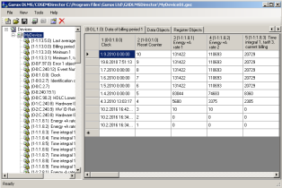

See An [Gurux](http://www.gurux.org/ "Gurux") for an overview.

Join the Gurux Community or follow [@Gurux](https://twitter.com/guruxorg "@Gurux") for project updates.

With GXDLMSDirector application you to read you DLMS/COSEM compatible electricity, gas or water meters. 
You can control your meters with easy to use user interface. 

Best part is that you can control your different meters with same application. 
You do not need manufactur specific applications. 

For more info check out [GXDLMSDirector](http://www.gurux.fi/index.php?q=GXDLMSDirector "GXDLMSDirector").

We are updating documentation on Gurux web page. 

Because DLMS manufacturers are using different parameters for meters we are updating [default meters settings](http://www.gurux.fi/index.php?q=GXDLMSDirectorExample).
We'll try to make your meter reading as easy as possible.

GXDLMSDirector [Help](http://www.gurux.fi/index.php?q=GXDLMSDirectorHelp "help") aids you to get started.

If you have problems or ideas you can ask your questions in Gurux GXDLMSDirector [Forum](http://www.gurux.fi/index.php?q=GXDLMSCOSEMDirectorForum).

If you want to build source codes you need Nuget package manager for Visual Studio.
You can get it here:
https://visualstudiogallery.msdn.microsoft.com/27077b70-9dad-4c64-adcf-c7cf6bc9970c